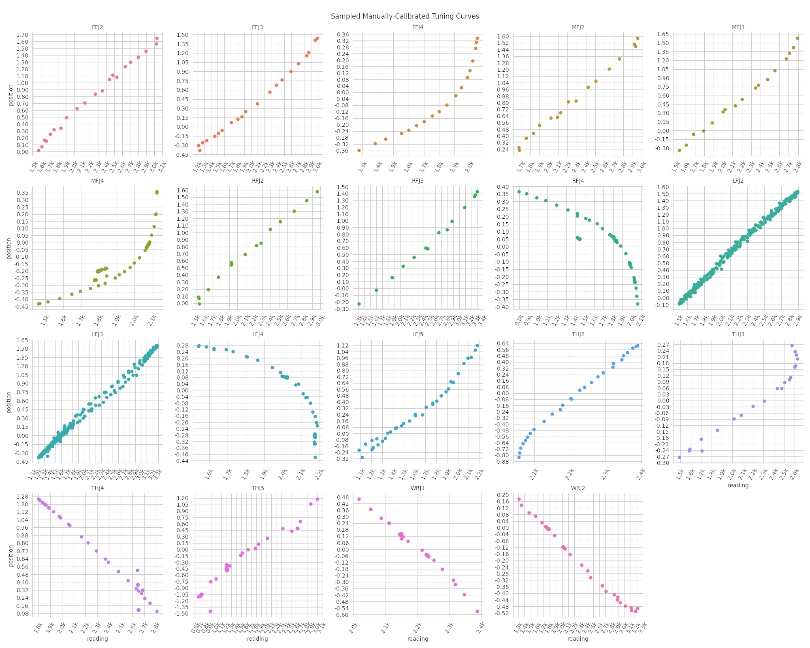

# Manual Joint Offset Calibration

After quite some frustration with automated joint calibration frameworks, here is a small effort to manually calibrate non-linear tuning curves of robot joints, in particular for a Shadow Dexterous Hand.

The hand should be visible in the field of view of the camera with the only untuned transforms being the finger joints you are going to calibrate. During data collection the main goal is always to adjust joint offsets via sliders to make the model fit the camera data.
Once you are happy with the current model fit, record a sample.

Afterwards look through the collected dataset in the notebook and fit piecewise linear functions for each joint.
The resulting functions can be copied into a `calibration.yaml` file in the `sr_hand_config` package.

I strongly recommend doing separate calibration runs for different joints as fitting the whole hand for each sample is very tedious.
Here is some data I collected for our Shadow Dexterous Hand:

